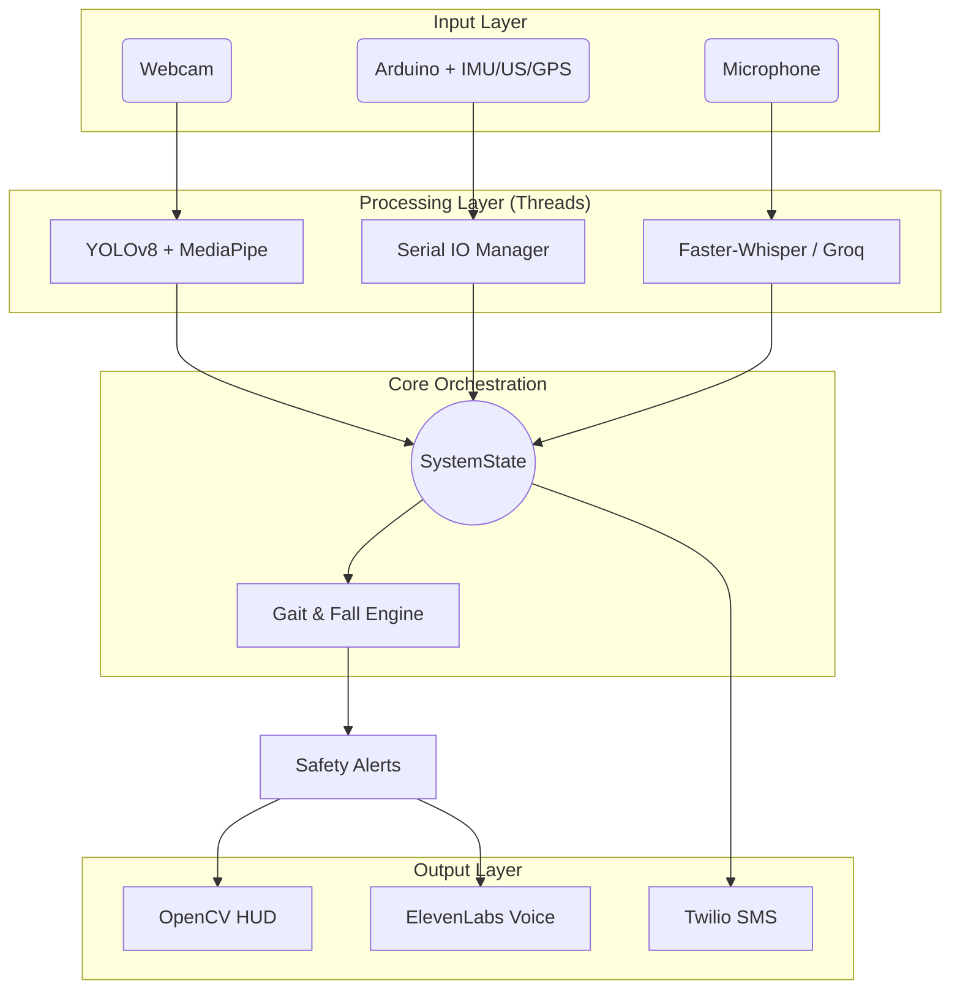

# AI Mobility Assistant
### Real-Time Gait Analysis, Fall Prevention & Assistive Navigation Platform

A real-time rehabilitation and mobility assistance platform that combines computer vision, sensor fusion, and voice interaction to provide gait analysis, fall detection, obstacle awareness, and adaptive mobility coaching on low-cost hardware.

---

# Project Highlights

*   **Real-time gait analysis** (symmetry, cadence, posture monitoring) using MediaPipe Pose.
*   **YOLOv8-based obstacle detection** with voice-guided navigation assistance.
*   **IMU + computer vision sensor fusion** for robust fall and pre-fall detection.
*   **Multi-threaded architecture** coordinating vision, audio, and hardware services.
*   **Adaptive voice coaching** using local speech recognition and context-aware LLM assistance.
*   **Edge-first deployment** ensuring safety-critical operations function entirely offline.

---

# Impact

This project explores how low-cost consumer hardware can deliver mobility assistance capabilities typically associated with specialized clinical systems. By combining edge AI, sensor fusion, and voice interaction, the platform provides real-time safety feedback while preserving user privacy through local-first processing.

---

# Technology Stack

| Layer | Technology |
| :--- | :--- |
| **Vision** | OpenCV, MediaPipe Pose, YOLOv8 |
| **Embedded** | C++, Arduino, MPU9250 (IMU), Ultrasonic (HC-SR04) |
| **Speech** | Faster-Whisper (Local), Groq (Cloud LLM Enhancement) |
| **Voice/IO** | ElevenLabs (TTS), Pygame, Twilio (SMS) |
| **Runtime** | Python 3.10+ (Multi-threaded orchestration) |

---

# Technical Contributions

Key components designed and implemented:

*   **Multi-threaded Orchestration:** Coordinated 4+ asynchronous services (Vision, Serial, Audio, LLM) via a thread-safe global state.
*   **Sensor Fusion Logic:** Integrated IMU tilt-rates with CV skeletal landmarks to increase fall detection specificity.
*   **State-Machine Safety Pipeline:** Implemented robust orientation tracking (Upright -> Falling -> Fallen) to reduce false positives.
*   **Arduino Firmware:** Developed acquisition loops with complementary filtering for stable real-time orientation telemetry.
*   **Real-Time HUD:** Designed a visualization overlay for gait symmetry, MET expenditure, and obstacle navigation.
*   **Adaptive Coaching Workflow:** Context-aware routing between local safety alerts and high-level LLM guidance.

---

# System Architecture

The following diagram illustrates the multi-threaded orchestration between hardware telemetry, vision inference, and the centralized state machine.



---

# Key Engineering Decisions

### Why YOLOv8 instead of Cloud-based Detection?
*   **Decision:** Run YOLOv8s locally via `ultralytics`.
*   **Rationale:** Cloud detection introduces 200ms+ round-trip latency. Local inference typically provides sub-100ms response times on consumer hardware, critical for real-time obstacle avoidance.

### Why CSV/JSON instead of PostgreSQL?
*   **Decision:** Export to localized flat files in `exports/`.
*   **Rationale:** As a single-user edge device, a database adds unnecessary setup complexity and runtime I/O overhead for high-frequency (2Hz) research logging.

### Why a Thread-based Shared-Memory Model?
*   **Decision:** Python `threading` with `threading.RLock`.
*   **Rationale:** Low-latency access to the latest frame and sensor data is required across asynchronous services. Distributed messaging (ROS/MQTT) would introduce unnecessary serialization overhead.

---

# Performance Characteristics

*Observed on i7-12th Gen / 16GB RAM.*

| Metric | Observed Value | Implementation Detail |
| :--- | :--- | :--- |
| **Vision Inference** | 12–15 FPS | MediaPipe + YOLOv8s (CPU) |
| **Sensor Telemetry** | 20 Hz | Arduino Serial @ 57.6k baud |
| **Safety Latency** | Typically < 100 ms | Event-to-HUD/TTS trigger |
| **Coaching Frequency** | Every 8–12s | Adaptive rate-limiting to prevent fatigue |

---

# Lessons Learned

*   **Reliability > Accuracy:** In safety-critical systems, a stable signal is more valuable than a high-fidelity one with high latency.
*   **Temporal Context:** Reliable fall detection requires a window of time, not just a snapshot. Moving to state-based detection significantly reduced false-positive rates.
*   **Sensor Synergy:** Fusion provides significantly more robust safety signals than any individual modality.
*   **Graceful Degradation:** Designing fallback behavior (e.g., "Software-Only" mode) is as critical as the primary workflow.

---

# Known Limitations

*   **Lighting Sensitivity:** Pose estimation quality decreases in low-light environments.
*   **Ultrasonic Echoes:** Sensors may return false distances on angled surfaces.
*   **Clinical Validation:** Heuristics are research-oriented and not clinically validated.

---

# Setup & Usage

1.  **Hardware:** Upload `mobility_assistant.ino` to Arduino (MPU9250 + Ultrasonics).
2.  **Software:** 
    ```bash
    pip install -r requirements.txt
    python main.py
    ```
3.  **Config:** Thresholds are configurable in `config.py`.
